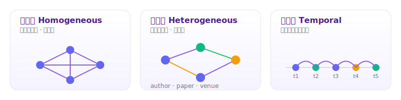
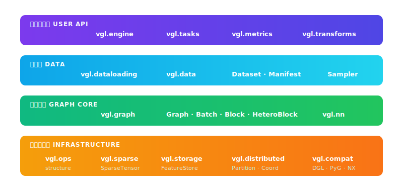
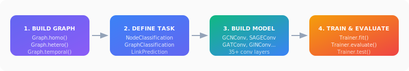
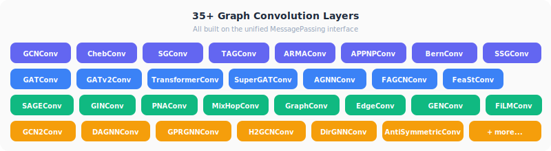

<p align="center">
  
</p>

<p align="center">
  <b>Unified graph learning framework with a stable core abstraction for homogeneous, heterogeneous, and temporal graphs.</b>
</p>

<p align="center">
  <a href="https://www.python.org/downloads/"></a>
  <a href="https://pytorch.org/"></a>
  
  
</p>

---

**VGL** (Versatile Graph Learning) is a PyTorch-first graph learning library that provides **one canonical `Graph` abstraction** for homogeneous, heterogeneous, and temporal graphs — plus a batteries-included training pipeline from data loading to evaluation.

<p align="center">
  
</p>

---

## Highlights

- **Unified `Graph` object** — a single data structure for homogeneous, heterogeneous, and temporal graphs with schema validation, lightweight views, and batching.
- **Dataset-style link prediction splits** — `RandomLinkSplit` creates train/val/test `LinkPredictionRecord` datasets that plug directly into the existing loader, sampler, and trainer stack.
- **Mini-batch neighbor sampling** — `NodeNeighborSampler`, `LinkNeighborSampler`, and `TemporalNeighborSampler` provide PyG/DGL-style local subgraph training for homogeneous, heterogeneous, and temporal node/link workloads, including relation-aware temporal event sampling for typed heterogeneous graphs, with opt-in plan-backed node/edge feature materialization for sampled node, link, and temporal batches. VGL also now exposes relation-local `to_block(...)` plus a lightweight `Block` container, and multi-relation `to_hetero_block(...)` plus `HeteroBlock`, for message-flow rewrites when one batch should be viewed as source/destination frontiers instead of one sampled subgraph. `NodeNeighborSampler(..., output_blocks=True)` materializes `NodeBatch.blocks` in outer-to-inner order while keeping `batch.graph` and `batch.seed_index` unchanged; homogeneous paths still emit `Block`, heterogeneous node workloads with exactly one inbound relation keep the relation-local `Block` path, and heterogeneous node workloads with zero or multiple inbound relations now emit per-hop `HeteroBlock` layers for both local full-graph sampling and stitched shard-local sampling through a coordinator-backed feature source. For link workloads, `LinkNeighborSampler(..., output_blocks=True)` now does the same without changing `batch.graph`, `src_index`, `dst_index`, or `labels`; homogeneous paths still emit `Block`, single-relation heterogeneous supervision keeps relation-local `Block`, and mixed-edge-type heterogeneous supervision can now emit full `HeteroBlock` layers through the same coordinator-backed feature source. When seed-edge exclusion is active those excluded supervision edges are removed from the block message-passing view as well. On shard-local graphs, coordinator-backed node and link sampling can now stitch cross-partition frontier nodes and edges into one sampled subgraph for homogeneous workloads and non-temporal heterogeneous node/link workloads, while `TemporalNeighborSampler` can stitch earlier cross-partition history for both homogeneous and typed heterogeneous temporal workloads.
- **Foundation layers for scale** — `vgl.sparse`, `vgl.storage`, `vgl.ops`, `vgl.data`, and `vgl.distributed` provide sparse adjacency views, graph sparse-format state APIs, weighted DGL-style adjacency exports, external sparse adjacency export, raw adjacency tensor exports, storage-backed graphs, graph transforms including line graphs, inbound/outbound frontier subgraphs, relation-local `to_block(...)` plus multi-relation `to_hetero_block(...)` message-flow rewrites, metapath reachability, relation-local hetero subgraphs/compaction, dataset catalogs / lazy on-disk formats, and local partition primitives plus typed node / edge routing, relation-scoped edge feature fetches, and partition-scoped local, boundary, and incident graph queries while keeping `Graph`, `Loader`, and `Trainer` as the public entry points.
- **50+ GNN convolution layers** — all built on a clean `MessagePassing` interface: `GCNConv`, `GATConv`, `SAGEConv`, `GINConv`, `TransformerConv`, and [many more](#supported-convolution-layers).
- **Graph transformer encoders** — reusable encoder blocks such as `GraphTransformerEncoder`, `GraphormerEncoder`, `GPSLayer`, `NAGphormerEncoder`, and `SGFormerEncoder`.
- **Temporal encoders & memory** — temporal modules such as `TimeEncoder`, `TGATLayer`, `TGATEncoder`, `IdentityTemporalMessage`, and `TGNMemory` plug into event prediction without changing the training loop.
- **Edge-aware operators** — homogeneous graphs can now carry `edge_data`, enabling operators such as `NNConv`, `ECConv`, `GINEConv`, `GMMConv`, `CGConv`, `SplineConv`, `GatedGCNConv`, and `PDNConv`.
- **Point / geometric operators** — homogeneous graphs can also carry node positions via `pos`, enabling operators such as `PointNetConv` and `PointTransformerConv`.
- **Two-layer training logs** — default console progress plus pluggable structured loggers such as `JSONLinesLogger` and `TensorBoardLogger` make experiments easier to monitor and replay.
- **End-to-end training** — `Trainer` handles the full loop including `fit()`, `evaluate()`, `test()`, early stopping, best-checkpoint saving, full training-state checkpoint/resume, epoch history tracking, gradient accumulation, scheduled gradient accumulation, gradient clipping, gradient value clipping, adaptive gradient clipping, gradient centralization, gradient noise injection, layer-wise learning-rate strategies, classification label smoothing, label smoothing scheduling, focal loss, focal-gamma scheduling, generalized cross entropy, generalized-cross-entropy scheduling, symmetric cross entropy, symmetric-cross-entropy beta scheduling, Poly-1 cross entropy, Poly-1 epsilon scheduling, soft/hard bootstrap loss correction, bootstrap-beta scheduling, confidence-penalty scheduling, flooding-level scheduling, `LDAM`, LDAM-margin scheduling, logit adjustment, logit-adjustment tau scheduling, balanced softmax, class weighting / `pos_weight`, `pos_weight` scheduling, weight-decay scheduling, loss flooding, confidence-penalty regularization, `R-Drop` regularization, sharpness-aware optimization with `SAM`, `ASAM`, and `GSAM`, link prediction uniform / hard-negative / candidate-set sampling, random edge splitting, and neighbor-subgraph sampling with optional seed-edge exclusion, raw and filtered ranking evaluation metrics such as `MRR` and `Hits@K`, epoch-wise or step-wise LR scheduling including built-in warmup/cosine support and schedulers such as `OneCycleLR`, mixed precision, and training callbacks such as model checkpointing (including optional exception checkpointing), gradual unfreezing, deferred reweighting (`DRW`), EMA, SWA, and Lookahead.
- **Multiple graph tasks** — node classification, graph classification, link prediction, and temporal event prediction out of the box.
- **PyG & DGL compatibility** — bidirectional adapters for PyG data plus homogeneous, heterogeneous, and temporal DGL graph round-trips that preserve canonical edge types and temporal `time_attr` metadata, along with dedicated single-relation `Block` and multi-relation `HeteroBlock` <-> DGL block conversion for message-flow frontiers.
- **Clean, modular design** — domain-oriented package layout that separates concerns and stays easy to extend.

---

## Architecture

<p align="center">
  
</p>

| Package | Description |
|:--|:--|
| `vgl.graph` | `Graph`, `Block`, `GraphBatch`, `GraphSchema`, `GraphView`, node / edge stores |
| `vgl.sparse` | `SparseTensor`, COO/CSR/CSC conversion helpers, multi-value payload support, transpose/reduction utilities, multi-value SPMM/SDDMM, edge softmax, sparse graph ops |
| `vgl.storage` | tensor stores including mmap-backed tensors, `FeatureStore`, `GraphStore`, storage-backed graph assembly with retained feature-source context |
| `vgl.ops` | structure transforms, frontier subgraphs, relation-local `to_block`, multi-relation `to_hetero_block`, line graphs, random walks, metapath random walks, metapath reachability, homo/hetero relation-local subgraph extraction, k-hop expansion, compaction |
| `vgl.data` | dataset catalog models, cache helpers, built-in datasets, lazy homo/hetero/temporal on-disk datasets |
| `vgl.dataloading` | `DataLoader`, `SamplingPlan`, plan executor, samplers, sample records, explicit-or-graph-retained feature-source routing and sampled feature materialization |
| `vgl.distributed` | partition metadata, local shard loading, store adapters, typed node/edge routing, local/boundary/incident partition queries, sampling coordination, routed feature sources |
| `vgl.nn` | `MessagePassing`, 50+ convolution layers, graph/temporal encoders, `HeteroConv`, readout, `GroupRevRes` |
| `vgl.tasks` | `NodeClassificationTask`, `GraphClassificationTask`, `LinkPredictionTask`, `TemporalEventPredictionTask` |
| `vgl.engine` | `Trainer`, callbacks, checkpoints, `TrainingHistory`, evaluator, training strategies |
| `vgl.metrics` | `Accuracy`, `Metric` base, `build_metric` |
| `vgl.transforms` | Graph transforms (identity, extensible) |
| `vgl.compat` | PyG and DGL bidirectional converters |

> Legacy imports (`vgl.core`, `vgl.data`, `vgl.train`) remain as compatibility layers but new code should use the layout above.

### Foundation Layers

- `vgl.sparse` is where adjacency layouts and sparse execution helpers live. It now exposes COO/CSR/CSC conversion, transpose, row/column structural selection, sparse edge payloads shaped `(nnz, ...)`, additive reductions that preserve trailing payload dimensions, sampled dense-dense matmul through `sddmm(...)`, edge-wise normalization through `edge_softmax(...)`, and `spmm(...)` that preserves sparse payload dimensions while appending dense feature channels at the end of the output shape, plus cached adjacency views through `Graph.adjacency(...)` and incidence-matrix views through `Graph.inc(...)`.
- `vgl.storage` turns in-memory or mmap-backed tensor stores plus graph stores into lazily feature-backed `Graph` objects through `Graph.from_storage(...)`, which is the main path for large-graph and feature-store-backed workflows. Storage-backed graphs retain their originating feature source so later plan execution can reuse it without extra wiring.
- `vgl.ops` centralizes reusable graph transforms plus graph queries. Alongside `find_edges(...)`, `edge_ids(...)`, and `has_edges_between(...)`, it now exposes `num_nodes(...)` / `num_edges(...)` with `number_of_*` aliases for graph cardinality, `all_edges(...)` for DGL-style full-edge enumeration, graph format-state helpers through `formats(...)` and `create_formats_(...)`, `adj(...)` for DGL-style weighted adjacency sparse views, `adj_external(...)` for torch / SciPy sparse adjacency export, `adj_tensors(...)` for raw COO/CSR/CSC adjacency tensor export, `inc(...)` for DGL-style incidence sparse views, `in_edges(...)`, `out_edges(...)`, `predecessors(...)`, and `successors(...)` for ordered one-hop adjacency, plus `in_degrees(...)` / `out_degrees(...)` for degree inspection. Count helpers return Python `int`, degree queries return `int` for one node and tensors for many or all nodes, and both continue to respect storage-backed declared node counts so isolated nodes surface as zero instead of disappearing. `formats()` reports graph-level sparse-format status, `create_formats_()` eagerly materializes all allowed formats, and `all_edges(order="eid")`, `adj(...)`, `adj_external(...)`, `adj_tensors(...)`, and `inc(...)` all follow the public `e_id` ordering model when present. `adj(..., eweight_name="weight")` uses edge features as sparse values, `adj_external(...)` returns either `torch.sparse_coo_tensor` or SciPy `coo` / `csr` matrices with unit values, and `adj_tensors("coo")` returns `(src, dst)` while `adj_tensors("csr")` / `adj_tensors("csc")` return compressed pointers, compressed coordinates, and aligned public edge ids. `inc(typestr="both")` drops self-loop nonzeros just like DGL. `in_subgraph(...)` / `out_subgraph(...)` keep node space intact, `reverse(...)` swaps endpoints while preserving `e_id` and storage-backed node-count context, `to_block(...)` keeps relation-local message-flow rewrites and `src_n_id` / `dst_n_id` / `e_id` metadata aligned, and `to_hetero_block(...)` builds one multi-relation heterogeneous message-flow layer from per-type destination frontiers.
- `vgl.data` now includes dataset manifests, local cache helpers, fixture-backed datasets, and an on-disk graph dataset format that writes one payload per graph under `graphs/`, loads items lazily, exposes manifest-backed split views, keeps legacy `graphs.pt` artifacts readable, and round-trips homogeneous, heterogeneous, and temporal graphs for reproducible pipelines.
- `vgl.distributed` starts the shard-aware surface with partition manifests, deterministic local partition writing, local shard loading, shard/global id remapping, owned-local plus boundary/incident partition edge queries, and single-process coordination contracts. The current local partition path now handles homogeneous, temporal homogeneous, single-node-type multi-relation, and true multi-node-type heterogeneous graphs without changing the overall manifest/payload workflow. Typed partition ownership flows through `PartitionManifest`, `LocalGraphShard`, and `LocalSamplingCoordinator`, so node routing can be scoped by `node_type`, relation-scoped edge ids can be routed by `edge_type`, boundary frontier structure can be queried explicitly through boundary and incident edge ids/indexes, edge features can be fetched through keys such as `('edge', edge_type, 'weight')`, and plan-backed feature fetch stages can route through the same coordinator when `Loader` or `PlanExecutor` receives it as the feature source or falls back to a graph-retained source. When those stages run during node, link, or temporal sampling, the fetched slices are now materialized back into the sampled subgraph instead of staying stranded in executor state. For shard-local homogeneous graphs, `NodeNeighborSampler` and `LinkNeighborSampler` can now stitch cross-partition frontier structure through coordinator incident-edge queries, and homogeneous `TemporalNeighborSampler` can stitch earlier cross-partition history. For shard-local non-temporal heterogeneous graphs, `NodeNeighborSampler` and `LinkNeighborSampler` can now stitch cross-partition typed frontier structure through the same coordinator while keeping sampled node and edge tensors aligned by per-type global `n_id` / `e_id`. For shard-local typed heterogeneous temporal graphs, `TemporalNeighborSampler` can now stitch earlier cross-partition relation-local history through the same coordinator while keeping per-type node tensors aligned by global `n_id` and sampled relation edges aligned by global `e_id`.

These layers are intentionally underneath the user-facing API: models still consume `Graph` / batch objects, loaders still start at `Loader`, and training still starts at `Trainer`.

---

## Quick Tour

<p align="center">
  
</p>

### Node Classification

```python
import torch
from vgl.dataloading import DataLoader, ListDataset, NodeNeighborSampler
from vgl.graph import Graph
from vgl.tasks import NodeClassificationTask
from vgl.engine import JSONLinesLogger, Trainer

graph = Graph.homo(edge_index=edge_index, x=x, y=y,
                   train_mask=train_mask, val_mask=val_mask, test_mask=test_mask)

train_ds = ListDataset([(graph, {"seed": int(i)}) for i in graph.train_mask.nonzero().view(-1)])
val_ds   = ListDataset([(graph, {"seed": int(i)}) for i in graph.val_mask.nonzero().view(-1)])
test_ds  = ListDataset([(graph, {"seed": int(i)}) for i in graph.test_mask.nonzero().view(-1)])

train_loader = DataLoader(train_ds, sampler=NodeNeighborSampler([15, 10]), batch_size=1024)
val_loader   = DataLoader(val_ds, sampler=NodeNeighborSampler([15, 10]), batch_size=2048)
test_loader  = DataLoader(test_ds, sampler=NodeNeighborSampler([15, 10]), batch_size=2048)

task = NodeClassificationTask(target="y",
                              split=("train_mask", "val_mask", "test_mask"),
                              metrics=["accuracy"])

trainer = Trainer(model=model, task=task,
                  optimizer=torch.optim.Adam, lr=1e-3, max_epochs=200,
                  monitor="val_accuracy", save_best_path="best.pt",
                  loggers=[JSONLinesLogger("artifacts/train.jsonl", flush=True)],
                  log_every_n_steps=10)

history = trainer.fit(train_loader, val_data=val_loader)
result  = trainer.test(test_loader)
print(f"Test accuracy: {result['accuracy']:.4f}")
```

Each node-sampling dataset item can carry one seed or a rank-1 seed collection in `metadata["seed"]`. `NodeNeighborSampler` will sample one union subgraph for that item and materialize one flat `NodeBatch.seed_index` entry per requested seed. For heterogeneous graphs, keep passing `metadata["node_type"]` for the supervised node type. `NodeNeighborSampler(..., output_blocks=True)` also exposes `NodeBatch.blocks` in outer-to-inner order without changing `batch.graph` or `batch.seed_index`; homogeneous paths emit `Block`, heterogeneous node paths with one inbound relation keep relation-local `Block`, and heterogeneous node paths with zero or multiple inbound relations now emit `HeteroBlock`.

`Trainer` writes console progress by default. Add `loggers=[JSONLinesLogger(...)]` for structured event logs, `loggers=[CSVLogger(...)]` for epoch-by-epoch spreadsheets, `loggers=[TensorBoardLogger(...)]` for TensorBoard scalars, tune step frequency with `log_every_n_steps`, or disable terminal logging with `enable_console_logging=False`.

For experiment hygiene and quick debugging, `Trainer` also supports a small set of trainer-level engineering controls:

```python
trainer = Trainer(
    ...,
    default_root_dir="artifacts/node-demo",
    run_name="debug-neighbors",
    fast_dev_run=True,
    num_sanity_val_steps=2,
    val_check_interval=0.5,
    profiler="simple",
)
```

`default_root_dir` resolves relative artifact paths such as `save_best_path="best.pt"` or `JSONLinesLogger("train.jsonl")` under one run directory, `run_name` is recorded in structured logs and `TrainingHistory`, `fast_dev_run` caps every stage to a tiny sample, forces a single epoch, and suppresses automatic checkpoint writes, `num_sanity_val_steps` validates a few batches before training starts, `val_check_interval` can trigger extra validation passes inside an epoch, and `profiler="simple"` adds coarse timing totals to fit/epoch records without extra dependencies. For finer control, `limit_train_batches`, `limit_val_batches`, and `limit_test_batches` accept either a max batch count or a `(0, 1]` fraction.

The default console logger is also configurable through `Trainer`:

```python
trainer = Trainer(
    ...,
    enable_progress_bar=False,
    console_mode="compact",
    console_theme="cat",
    console_metric_names={"loss", "train_loss", "val_loss"},
    console_show_learning_rate=False,
    console_show_events=False,
)
```

Console logs include `HH:MM:SS` timestamps by default. Detailed mode now starts each run with a compact summary card showing the model, task, optimizer, monitor, precision, and parameter counts, prints explicit stage-start lines for training / validation / testing, shows `tqdm`-style training-step context such as batch progress, percentage, throughput, and ETA, adds whole-fit progress fields such as `fit=3/10 (30.0%)` plus `fit_eta=...` in epoch summaries, and ends with fit-wide averages such as `avg_epoch_time=...` and `avg_steps_per_second=...`. Use `console_mode="compact"` for terse summaries, `console_theme="cat"` for an ASCII status mascot with stage labels such as `starting`, `waiting`, `training`, `validating`, `testing`, `tracking`, `saving`, and `done` plus distinct cat faces per phase and a small ASCII progress bar during training steps, `console_metric_names={...}` to whitelist printed metrics, and the `console_show_*` flags to hide learning-rate fields or lifecycle events from terminal output while keeping them in structured logs. Set `console_show_timestamp=False` if you want to remove the time prefix.

`JSONLinesLogger` also supports event filtering when you only want coarse summaries:

```python
from vgl.engine import JSONLinesLogger

logger = JSONLinesLogger("artifacts/epochs.jsonl", events={"epoch_end", "fit_end"}, flush=True)
```

Emitted training-step and epoch-end records now include optimizer learning-rate fields such as `lr` (or `lr/group_0`, `lr/group_1`, ... for multiple parameter groups).

Structured logs now also include richer lifecycle events such as `monitor_improved` and `checkpoint_saved`; `monitor_improved` records carry `previous_best`, `current_value`, and `improvement_delta` so terminal and file logs can show how much the monitor moved, while `checkpoint_saved` records now carry `size_bytes` and `save_seconds` for artifact visibility. Run metadata on `fit_start` includes model/task/optimizer names and parameter counts.

You can also trim structured logs by metric and context:

```python
from vgl.engine import CSVLogger, JSONLinesLogger

json_logger = JSONLinesLogger(
    "artifacts/minimal.jsonl",
    events={"epoch_end", "fit_end"},
    metric_names={"train_loss", "val_loss"},
    include_context=False,
    show_learning_rate=False,
    flush=True,
)
csv_logger = CSVLogger(
    "artifacts/minimal.csv",
    metric_names={"train_loss", "val_loss"},
    include_context=False,
    show_learning_rate=False,
    flush=True,
)
```

`metric_names={...}` whitelists metrics written to file, `show_learning_rate=False` hides `lr` / `lr/group_*` fields, and `include_context=False` keeps only the core event coordinates plus the filtered metrics.

For TensorBoard integration:

```python
from vgl.engine import TensorBoardLogger

tb_logger = TensorBoardLogger(
    "artifacts/tensorboard",
    events={"train_step", "epoch_end", "fit_end"},
    show_learning_rate=False,
    flush=True,
)
```

`TensorBoardLogger` writes step / epoch / fit scalars plus run metadata to an event directory. Launch TensorBoard with `tensorboard --logdir artifacts/tensorboard`. This logger requires the optional `tensorboard` package.

### Graph Classification

```python
from vgl.dataloading import DataLoader, ListDataset, FullGraphSampler, SampleRecord
from vgl.tasks import GraphClassificationTask

samples = [SampleRecord(graph=g, metadata={}, sample_id=str(i)) for i, g in enumerate(graphs)]
loader  = DataLoader(dataset=ListDataset(samples), sampler=FullGraphSampler(),
                     batch_size=32, label_source="graph", label_key="y")

task    = GraphClassificationTask(target="y", label_source="graph")
trainer = Trainer(model=model, task=task, optimizer=torch.optim.Adam, lr=1e-3, max_epochs=50)
trainer.fit(loader)
```

### Link Prediction

```python
from vgl.dataloading import CandidateLinkSampler, DataLoader, LinkNeighborSampler, UniformNegativeLinkSampler
from vgl.tasks import LinkPredictionTask
from vgl.transforms import RandomLinkSplit

train_ds, val_ds, test_ds = RandomLinkSplit(
    num_val=0.1,
    num_test=0.1,
    disjoint_train_ratio=0.3,
    neg_sampling_ratio=1.0,
    add_negative_train_samples=False,
    seed=0,
)(graph)

train_loader = DataLoader(
    train_ds,
    sampler=LinkNeighborSampler(
        num_neighbors=[15, 10],
        base_sampler=UniformNegativeLinkSampler(num_negatives=2),
    ),
    batch_size=32,
)
val_loader = DataLoader(
    val_ds,
    sampler=LinkNeighborSampler(
        num_neighbors=[15, 10],
        base_sampler=CandidateLinkSampler(),
    ),
    batch_size=64,
)
test_loader = DataLoader(
    test_ds,
    sampler=LinkNeighborSampler(
        num_neighbors=[15, 10],
        base_sampler=CandidateLinkSampler(),
    ),
    batch_size=64,
)

task    = LinkPredictionTask(target="label", metrics=["mrr", "filtered_mrr", "filtered_hits@10"])
trainer = Trainer(model=model, task=task, optimizer=torch.optim.Adam, lr=1e-3, max_epochs=50)
trainer.fit(train_loader, val_data=val_loader)
trainer.test(test_loader)
```

### Link Prediction Ranking Evaluation

```python
from vgl.dataloading import CandidateLinkSampler, DataLoader, ListDataset, LinkPredictionRecord
from vgl.tasks import LinkPredictionTask

eval_samples = [
    LinkPredictionRecord(graph=graph, src_index=0, dst_index=1, label=1),
    LinkPredictionRecord(graph=graph, src_index=3, dst_index=4, label=1, candidate_dst=[4, 8, 9, 10]),
]

eval_loader = DataLoader(
    dataset=ListDataset(eval_samples),
    sampler=CandidateLinkSampler(filter_known_positive_edges=True),
    batch_size=2,
)

task = LinkPredictionTask(target="label", metrics=["mrr", "filtered_mrr", "filtered_hits@10"])
history = trainer.evaluate(eval_loader)
```

Use `UniformNegativeLinkSampler` or `HardNegativeLinkSampler` for training-time sampled negatives, `CandidateLinkSampler` for validation/test-time ranking over all destinations or an explicit `candidate_dst` set, and wrap either one with `LinkNeighborSampler` when you want mini-batch message passing on local subgraphs instead of full-graph propagation.

Pass `node_feature_names=...` and `edge_feature_names=...` to `LinkNeighborSampler` when those sampled link subgraphs should rehydrate node/edge tensors from an external feature store. For heterogeneous graphs, provide dictionaries keyed by node type and edge type.

`LinkNeighborSampler(..., output_blocks=True)` also exposes `LinkPredictionBatch.blocks` in outer-to-inner order while keeping `batch.graph`, `batch.src_index`, `batch.dst_index`, and `batch.labels` unchanged. This now covers local and stitched homogeneous link sampling plus heterogeneous link sampling through a coordinator-backed feature source. Those blocks are derived from the sampled message-passing graph rather than a raw supervision view, so positive edges hidden by `exclude_seed_edge` / `exclude_seed_edges` stay excluded from block message passing as well. On heterogeneous graphs, single-relation supervision keeps relation-local `Block`, while mixed-edge-type supervision can now emit `HeteroBlock`.

For heterogeneous link prediction, pass edge types explicitly:

```python
train_ds, val_ds, test_ds = RandomLinkSplit(
    num_val=0.1,
    num_test=0.1,
    edge_type=("author", "writes", "paper"),
    rev_edge_type=("paper", "written_by", "author"),
)(hetero_graph)
```

Each resulting `LinkPredictionRecord` keeps `edge_type` (and optional `reverse_edge_type`) so negative sampling, neighbor sampling, and seed-edge exclusion stay relation-aware.

`disjoint_train_ratio` holds out a fraction of train positives as supervision-only edges (removed from train/val/test message-passing graphs), while `neg_sampling_ratio` can add pre-sampled negatives directly into split datasets when you want split-time labels instead of sampler-time negatives.

`LinkPredictionBatch` now also supports mixing multiple heterogeneous supervision relations in the same mini-batch, exposing `batch.edge_types` and `batch.edge_type_index` so models can route each record to the correct source/destination node-type encoders.

```python
author_x = author_encoder(batch.graph.nodes["author"].x)
paper_x = paper_encoder(batch.graph.nodes["paper"].x)
logits = []
for i, rel_id in enumerate(batch.edge_type_index.tolist()):
    src_type, _, dst_type = batch.edge_types[rel_id]
    src_bank = author_x if src_type == "author" else paper_x
    dst_bank = author_x if dst_type == "author" else paper_x
    logits.append(score(torch.cat([src_bank[batch.src_index[i]], dst_bank[batch.dst_index[i]]], dim=-1)))
```

### Temporal Event Prediction

```python
from vgl.dataloading import DataLoader, FullGraphSampler, ListDataset, TemporalEventRecord, TemporalNeighborSampler
from vgl.tasks import TemporalEventPredictionTask

graph = Graph.temporal(nodes=nodes, edges=edges, time_attr="timestamp")
samples = [
    TemporalEventRecord(graph=graph, src_index=0, dst_index=1, timestamp=3, label=1),
    TemporalEventRecord(graph=graph, src_index=2, dst_index=0, timestamp=5, label=0),
]
full_loader = DataLoader(ListDataset(samples), sampler=FullGraphSampler(), batch_size=2)
sampled_loader = DataLoader(
    ListDataset(samples),
    sampler=TemporalNeighborSampler(num_neighbors=[20, 10], max_events=1024),
    batch_size=2,
)
task = TemporalEventPredictionTask(target="label")
```

Use `FullGraphSampler` when the model should see the full temporal graph for each event, or switch to `TemporalNeighborSampler` to build strict-history local subgraphs with optional hop fanout, rolling time windows, and `max_events` caps.

For typed heterogeneous temporal graphs, pass `edge_type=` on each `TemporalEventRecord`. The resulting `TemporalEventBatch` mirrors the typed link-prediction contract through `edge_type` / `edge_types`, `edge_type_index`, and `src_node_type` / `dst_node_type`, while `TemporalNeighborSampler` keeps strict-history extraction and feature prefetch scoped to that relation instead of mixing all event types. When the source graph is shard-local and sampled through `LocalSamplingCoordinator`, that relation-local history can also stitch earlier cross-partition events into one typed temporal subgraph.

`TemporalNeighborSampler(node_feature_names=..., edge_feature_names=...)` can append plan-backed fetch stages as well, so strict-history event batches can overlay sampled `x` / edge features from a retained graph feature store or an explicit `feature_store=` source.

---

## Installation

### Requirements

- Python ≥ 3.11
- PyTorch ≥ 2.4

### From Source

```bash
git clone https://github.com/<your-org>/VGL.git
cd VGL
pip install -e .
```

### With Development Dependencies

```bash
pip install -e ".[dev]"    # adds pytest, ruff, mypy
```

Simple homogeneous graphs stay on DGL's lightweight `dgl.graph(...)` path. Typed or temporal VGL graphs export through `dgl.heterograph(...)` so canonical edge types survive, and temporal round-trips preserve `Graph.schema.time_attr` through the adapter-owned `vgl_time_attr` graph attribute. Relation-local VGL `Block` objects now also round-trip through dedicated single-relation DGL block helpers.

---

## Supported Convolution Layers

<p align="center">
  
</p>

All layers are built on the `MessagePassing` base class and share a consistent `forward(x, edge_index, ...)` interface.

For edge-aware operators on homogeneous graphs, `Graph.homo(...)` also accepts `edge_data={...}` and exposes it through `graph.edata`.

<details>
<summary><b>Full list of 50+ convolution operators</b></summary>

| Category | Layers |
|:--|:--|
| **Spectral** | `GCNConv`, `ChebConv`, `SGConv`, `TAGConv`, `ARMAConv`, `APPNPConv`, `BernConv`, `SSGConv` |
| **Attention** | `GATConv`, `GATv2Conv`, `TransformerConv`, `SuperGATConv`, `AGNNConv`, `FAGCNConv`, `FAConv`, `FeaStConv`, `DNAConv` |
| **Relation-aware** | `RGCNConv`, `RGATConv`, `HGTConv`, `HEATConv`, `HeteroConv` |
| **Edge-aware** | `NNConv`, `ECConv`, `GINEConv`, `GMMConv`, `CGConv`, `SplineConv`, `GatedGCNConv`, `PDNConv` |
| **Point / Geometric** | `PointNetConv`, `PointTransformerConv` |
| **Semantic Hetero** | `HANConv` |
| **Aggregation** | `SAGEConv`, `GINConv`, `PNAConv`, `MixHopConv`, `GraphConv`, `EdgeConv`, `GENConv`, `FiLMConv`, `MFConv`, `GeneralConv`, `SimpleConv`, `EGConv`, `LEConv`, `LightGCNConv`, `LGConv`, `ClusterGCNConv` |
| **Deep / Residual** | `GCN2Conv`, `DAGNNConv`, `GPRGNNConv`, `H2GCNConv`, `DirGNNConv`, `TWIRLSConv`, `AntiSymmetricConv`, `GatedGraphConv`, `ResGatedGraphConv` |
| **Transformer Encoders** | `GraphTransformerEncoder`, `GraphormerEncoder`, `GPSLayer`, `NAGphormerEncoder`, `SGFormerEncoder` |
| **Temporal** | `TimeEncoder`, `TGATLayer`, `TGATEncoder`, `IdentityTemporalMessage`, `LastMessageAggregator`, `MeanMessageAggregator`, `TGNMemory` |
| **Other** | `WLConvContinuous`, `GroupRevRes` (grouped reversible residual wrapper) |

</details>

Additionally, `HeteroConv` provides a wrapper for applying different convolution operators per edge type in heterogeneous graphs.

### Readout / Pooling

| Function | Description |
|:--|:--|
| `global_mean_pool` | Mean readout over all nodes |
| `global_sum_pool` | Sum readout over all nodes |
| `global_max_pool` | Max readout over all nodes |

---

## Framework Compatibility

VGL provides bidirectional conversion with the two most popular graph learning libraries:

```python
from vgl.compat.pyg import from_pyg, to_pyg
from vgl.compat.dgl import (
    block_from_dgl,
    block_to_dgl,
    from_dgl,
    hetero_block_from_dgl,
    hetero_block_to_dgl,
    to_dgl,
)
from vgl.graph import Block, HeteroBlock

vgl_graph = from_pyg(pyg_data)          # PyG Data → VGL Graph
pyg_data  = to_pyg(vgl_graph)           # VGL Graph → PyG Data

vgl_graph = from_dgl(dgl_graph)         # DGL graph / heterograph → VGL Graph
dgl_graph = to_dgl(vgl_graph)           # VGL Graph → DGL graph / heterograph

vgl_block = block_from_dgl(dgl_block)   # single-relation DGL block → VGL Block
dgl_block = block_to_dgl(vgl_block)     # VGL Block → single-relation DGL block
dgl_block = vgl_block.to_dgl()          # convenience API
vgl_block = Block.from_dgl(dgl_block)   # convenience API

vgl_hetero_block = hetero_block_from_dgl(dgl_block)  # multi-relation DGL block → VGL HeteroBlock
dgl_block = hetero_block_to_dgl(vgl_hetero_block)    # VGL HeteroBlock → multi-relation DGL block
dgl_block = vgl_hetero_block.to_dgl()                # convenience API
vgl_hetero_block = HeteroBlock.from_dgl(dgl_block)   # convenience API
```

Simple homogeneous graphs stay on `dgl.graph(...)`. Typed or temporal VGL graphs export through `dgl.heterograph(...)` so canonical edge types survive, and temporal round-trips preserve `Graph.schema.time_attr` through the adapter-owned `vgl_time_attr` graph attribute. Graph adapters remain graph-only; message-flow frontiers use the relation-local `block_from_dgl(...)`, `block_to_dgl(...)`, `Block.from_dgl(...)`, and `Block.to_dgl()` path for single-relation DGL blocks, or the multi-relation `hetero_block_from_dgl(...)`, `hetero_block_to_dgl(...)`, `HeteroBlock.from_dgl(...)`, and `HeteroBlock.to_dgl()` path for heterogeneous DGL blocks. This means sampler-produced `HeteroBlock` layers can now round-trip through DGL without collapsing them back to one relation-local block.

---

## Examples

| Task | Script | Graph Type |
|:--|:--|:--|
| Node Classification | `examples/homo/node_classification.py` | Homogeneous |
| Graph Classification | `examples/homo/graph_classification.py` | Homogeneous |
| Link Prediction | `examples/homo/link_prediction.py` | Homogeneous |
| Conv Zoo (50+ layers) | `examples/homo/conv_zoo.py` | Homogeneous |
| Node Classification | `examples/hetero/node_classification.py` | Heterogeneous |
| Link Prediction | `examples/hetero/link_prediction.py` | Heterogeneous |
| Graph Classification | `examples/hetero/graph_classification.py` | Heterogeneous |
| Event Prediction (TGAT) | `examples/temporal/event_prediction.py` | Temporal |
| Event Prediction (TGN Memory) | `examples/temporal/memory_event_prediction.py` | Temporal |

Heterogeneous graph-classification batches keep `batch.graphs` intact and expose per-node-type membership through `graph_index_by_type` / `graph_ptr_by_type`, so models can pool `paper`, `author`, or other typed node representations without flattening the graph schema away.

Run any example with:

```bash
python examples/homo/node_classification.py
```

---

## Testing & Quality

```bash
# Run the full test suite
python -m pytest -v

# Lint check
python -m ruff check .

# Type check
python -m mypy vgl
```

The test suite covers:
- **Core**: Graph, batch, schema, views, heterogeneous/temporal constructors
- **Data**: Loaders, samplers, graph/link/temporal record pipelines
- **Training**: Trainer, tasks, metrics, callbacks, checkpoints, history
- **NN**: MessagePassing, all convolution operators, readout, GroupRevRes
- **Compat**: PyG and DGL adapter round-trips
- **Integration**: End-to-end workflows for all graph types and tasks

---

## Project Structure

```
VGL/
├── vgl/
│   ├── graph/          # Graph, GraphBatch, Schema, View, Stores
│   ├── nn/
│   │   ├── conv/       # 50+ convolution operators
│   │   ├── message_passing.py
│   │   ├── hetero.py   # HeteroConv
│   │   ├── readout.py  # global_mean/sum/max_pool
│   │   └── grouprevres.py
│   ├── tasks/          # Node/Graph/Link/Temporal task definitions
│   ├── engine/         # Trainer, callbacks, checkpoints, history
│   ├── metrics/        # Accuracy, Metric base
│   ├── dataloading/    # DataLoader, datasets, samplers, records
│   ├── transforms/     # Graph transforms
│   └── compat/         # PyG & DGL converters
├── examples/
│   ├── homo/           # Homogeneous graph examples
│   ├── hetero/         # Heterogeneous graph examples
│   └── temporal/       # Temporal graph examples
├── tests/              # Comprehensive test suite
├── docs/               # Documentation & design plans
└── pyproject.toml
```

---

## Documentation

- [Quickstart Guide](docs/quickstart.md)
- [Core Concepts](docs/core-concepts.md)
- [Migration Guide](docs/migration-guide.md)

---

## Contributing

Contributions are welcome! Please:

1. Fork the repository
2. Create a feature branch (`git checkout -b feature/my-feature`)
3. Ensure all tests pass (`python -m pytest -v`)
4. Ensure code quality (`python -m ruff check .` and `python -m mypy vgl`)
5. Submit a pull request

---

## License

See [LICENSE](LICENSE) for details.
