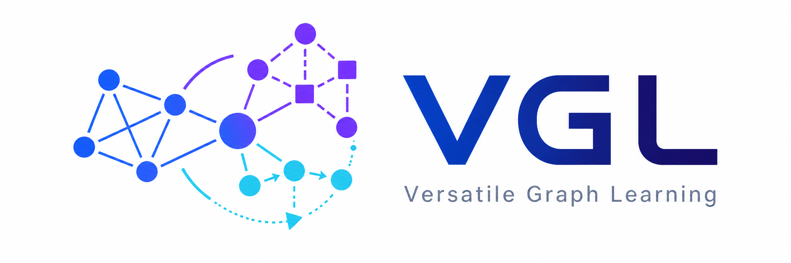
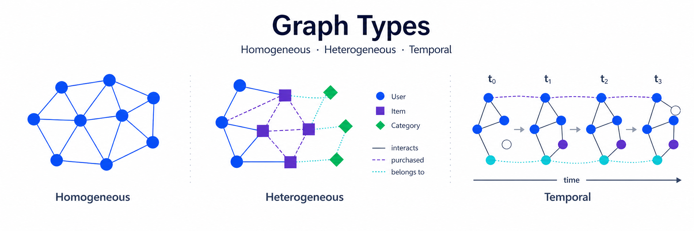
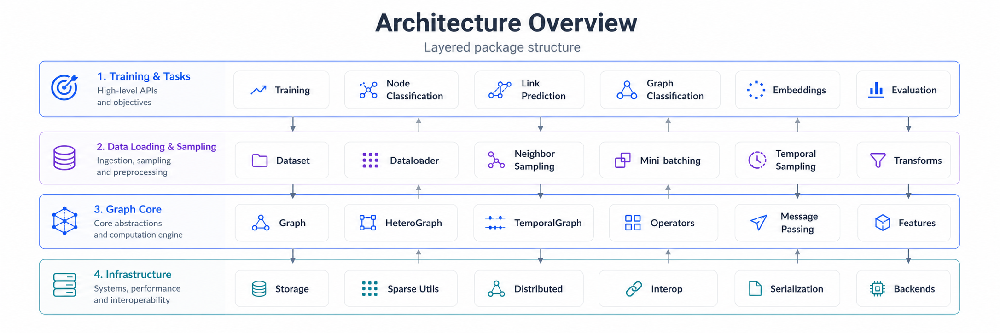
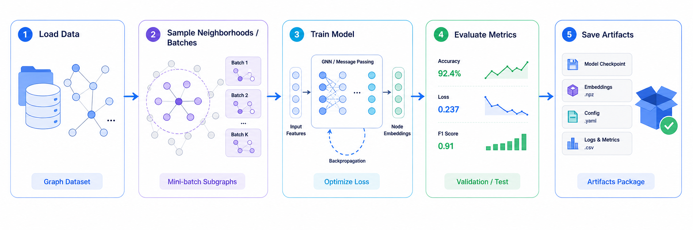
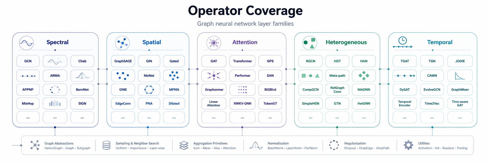

<p align="center">
  
</p>

<p align="center">
  <b>One graph learning surface for homogeneous, heterogeneous, and temporal workloads.</b>
</p>

<p align="center">
  <a href="https://www.python.org/downloads/"></a>
  <a href="https://pytorch.org/"></a>
  
  
</p>

<p align="center">
  <a href="https://skygazer42.github.io/sky-vgl/">Documentation</a>
  ·
  <a href="https://skygazer42.github.io/sky-vgl/getting-started/quickstart/">Quick Start</a>
  ·
  <a href="https://skygazer42.github.io/sky-vgl/api/">API Reference</a>
  ·
  <a href="https://skygazer42.github.io/sky-vgl/examples/">Examples</a>
  ·
  <a href="https://skygazer42.github.io/sky-vgl/support-matrix/">Support Matrix</a>
  ·
  <a href="https://github.com/skygazer42/sky-vgl/issues">Issues</a>
</p>

---

**VGL** is a PyTorch-first graph learning library with one canonical `Graph` abstraction, one data loading surface, and one training stack.

It is designed for teams that do not want separate APIs for homogeneous graphs, heterogeneous graphs, temporal event graphs, batching, sampling, checkpoints, and trainer orchestration. The same public package surface spans all of those concerns.

<p align="center">
  
</p>

## Why VGL

- **One graph container**: `Graph.homo()`, `Graph.hetero()`, and `Graph.temporal()` share one core representation with schema validation, views, and batching.
- **One training path**: `Trainer`, `Task`, `Metric`, checkpoints, callbacks, and loggers live in the same public surface instead of being stitched together ad hoc.
- **One sampling surface**: node, link, graph, and temporal sampling all flow through `vgl.dataloading`.
- **Interop without a separate project**: DGL, PyG, NetworkX, CSV, and edge-list adapters are built in.
- **Broad operator coverage**: VGL ships 60+ convolution and encoder components on a consistent `MessagePassing` foundation.

## Installation

VGL works with Python 3.10+ and PyTorch 2.4+.

```bash
pip install sky-vgl
pip install "sky-vgl[full]"
pip install "sky-vgl[networkx]"
pip install "sky-vgl[pyg]"
pip install "sky-vgl[dgl]"
```

Use `full` when you want the optional integration surface in one install. For environment-specific guidance, tested version combinations, and local verification commands, see the [Support Matrix](https://skygazer42.github.io/sky-vgl/support-matrix/) and the [Installation guide](https://skygazer42.github.io/sky-vgl/getting-started/installation/).

### Install from source

```bash
git clone https://github.com/skygazer42/sky-vgl.git
cd sky-vgl
pip install -e ".[dev]"
```

## Quick Start

The shortest path into VGL is the same pattern you see in mainstream Python ML packages:

1. Load or build a graph.
2. Define a plain PyTorch model.
3. Bind supervision through a `Task`.
4. Train and evaluate with `Trainer`.

```python
import torch
import torch.nn as nn
import torch.nn.functional as F

from vgl import PlanetoidDataset, Trainer
from vgl.nn import GCNConv
from vgl.tasks import NodeClassificationTask
from vgl.transforms import Compose, NormalizeFeatures


dataset = PlanetoidDataset(
    root="data",
    name="Cora",
    transform=Compose([NormalizeFeatures()]),
)
graph = dataset[0]


class GCN(nn.Module):
    def __init__(self, in_channels, hidden_channels, out_channels):
        super().__init__()
        self.conv1 = GCNConv(in_channels, hidden_channels)
        self.conv2 = GCNConv(hidden_channels, out_channels)

    def forward(self, graph):
        x = self.conv1(graph.x, graph)
        x = F.relu(x)
        x = F.dropout(x, p=0.5, training=self.training)
        return self.conv2(x, graph)


model = GCN(
    in_channels=graph.x.size(1),
    hidden_channels=64,
    out_channels=graph.y.max().item() + 1,
)

task = NodeClassificationTask(
    target="y",
    split=("train_mask", "val_mask", "test_mask"),
    metrics=["accuracy"],
)

trainer = Trainer(
    model=model,
    task=task,
    optimizer=torch.optim.Adam,
    lr=1e-2,
    max_epochs=200,
)

history = trainer.fit(graph, val_data=graph)
print(trainer.test(graph))
```

Next steps:

- [5-minute Quick Start](https://skygazer42.github.io/sky-vgl/getting-started/quickstart/)
- [User Guide](https://skygazer42.github.io/sky-vgl/guide/)
- [Examples](https://skygazer42.github.io/sky-vgl/examples/)
- [API Reference](https://skygazer42.github.io/sky-vgl/api/)

## Package Layout

| Module | What it gives you |
| :-- | :-- |
| `vgl.graph` | `Graph`, `GraphBatch`, `GraphView`, `Block`, `HeteroBlock`, schema-aware graph utilities |
| `vgl.dataloading` | `DataLoader`, samplers, sampling plans, sample records, materialization helpers |
| `vgl.nn` | graph operators, readout, encoders, `MessagePassing`, heterogeneous and temporal layers |
| `vgl.engine` | `Trainer`, callbacks, loggers, checkpoints, history, optimizer helpers |
| `vgl.tasks` | node classification, graph classification, link prediction, temporal prediction |
| `vgl.data` | built-in datasets, dataset registry, on-disk dataset support |
| `vgl.ops` | graph queries, compact/subgraph utilities, block construction, random walks |
| `vgl.compat` | DGL, PyG, NetworkX, CSV, and edge-list interoperability |
| `vgl.storage` | feature stores, graph stores, mmap-backed storage primitives |
| `vgl.transforms` | feature, split, and structure transforms |

`GraphBatch` is the canonical batched graph container for graph-level training inputs.
`GraphView` is the canonical read-only graph projection for snapshot/window-style access.
`NodeStore` and `EdgeStore` are lower-level storage-facing graph internals; prefer `Graph`, `GraphView`, and `GraphBatch` in application code.

## Architecture

VGL is organized around a stable public graph core plus task-oriented higher layers. The intended path is:

`Graph` -> `DataLoader` / samplers -> `Task` -> `Trainer`

That keeps the data model, batch model, and training loop aligned instead of exposing unrelated APIs that users have to reconcile themselves.

<p align="center">
  
</p>

<p align="center">
  
</p>

<p align="center">
  
</p>

If you want the fuller package walkthrough, see the [Architecture overview](https://skygazer42.github.io/sky-vgl/architecture/) and [Core concepts](https://skygazer42.github.io/sky-vgl/core-concepts/).

## Choosing VGL vs. PyG or DGL

Choose **VGL** when you want one consistent package surface across graph types and training workflows.

Choose **PyG** when your priority is the broader PyTorch-native graph ecosystem around `Data`, `HeteroData`, `NeighborLoader`, `HGTLoader`, `to_hetero()`, and optional compiled extensions.

Choose **DGL** when GraphBolt-style staged data pipelines or distributed graph training and sampling are first-order requirements.

References:

- [PyG README](https://github.com/pyg-team/pytorch_geometric)
- [PyG heterogeneous graph docs](https://pytorch-geometric.readthedocs.io/en/stable/notes/heterogeneous.html)
- [DGL README](https://github.com/dmlc/dgl)
- [DGL GraphBolt docs](https://www.dgl.ai/dgl_docs/api/python/dgl.graphbolt.html)
- [DGL distributed docs](https://www.dgl.ai/dgl_docs/api/python/dgl.distributed.html)

## Examples

Representative examples live under `examples/`:

- `examples/homo/node_classification.py`
- `examples/homo/graph_classification.py`
- `examples/homo/link_prediction.py`
- `examples/homo/conv_zoo.py`
- `examples/hetero/node_classification.py`
- `examples/hetero/link_prediction.py`
- `examples/hetero/graph_classification.py`
- `examples/temporal/event_prediction.py`
- `examples/temporal/memory_event_prediction.py`

The full, browsable set is documented on the [Examples page](https://skygazer42.github.io/sky-vgl/examples/).

## Documentation

The published documentation is at **[skygazer42.github.io/sky-vgl](https://skygazer42.github.io/sky-vgl/)**.

- [Getting Started](https://skygazer42.github.io/sky-vgl/getting-started/)
- [User Guide](https://skygazer42.github.io/sky-vgl/guide/)
- [API Reference](https://skygazer42.github.io/sky-vgl/api/)
- [Support Matrix](https://skygazer42.github.io/sky-vgl/support-matrix/)
- [Migration Guide](https://skygazer42.github.io/sky-vgl/migration-guide/)
- [Release Guide](https://skygazer42.github.io/sky-vgl/releasing/)
- [FAQ](https://skygazer42.github.io/sky-vgl/faq/)

## Development

Run the main local checks before sending a change upstream:

```bash
python -m pytest -q
python -m ruff check .
python -m mypy vgl
python -m mkdocs build --strict
```

Compatibility note:

Legacy compatibility namespaces stay supported through the current 0.x line. New code should migrate to `vgl.graph`, `vgl.dataloading`, `vgl.engine`, `vgl.tasks`, and `vgl.metrics` now. Breaking removals will be announced in the changelog before they ship.
See the [Migration guide](https://skygazer42.github.io/sky-vgl/migration-guide/) for the stable import paths.
Compatibility changes and migration notes are tracked in `docs/changelog.md`.
Performance-impacting changes should summarize benchmark method or artifact changes in `docs/changelog.md`.

## Contributing

Contributions are welcome.

1. Fork the repository.
2. Create a branch for your change.
3. Run the local verification commands.
4. Open a pull request with the problem statement, approach, and verification notes.

If your change affects packaging, release behavior, or optional backends, also read the [Release guide](https://skygazer42.github.io/sky-vgl/releasing/) and [Support Matrix](https://skygazer42.github.io/sky-vgl/support-matrix/).

## License

See [LICENSE](LICENSE).
