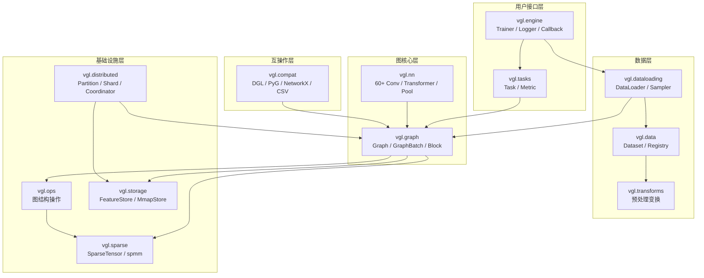

# 架构概览

VGL 采用分层模块化设计，每一层职责清晰，从底层稀疏运算到上层训练 pipeline 自下而上构建。

## 包结构



## 分层设计

### 基础设施层

| 模块 | 职责 |
|------|------|
| `vgl.sparse` | 稀疏张量（SparseTensor）、COO/CSR/CSC 布局、`spmm`、`sddmm`、`edge_softmax` |
| `vgl.storage` | 特征存储（FeatureStore）、图结构存储、mmap 张量后端 |
| `vgl.ops` | 图结构操作：子图、度数、邻接、拉普拉斯、随机游走、消息流重写 |
| `vgl.distributed` | 分区元数据、本地分片、采样协调器、跨分区特征路由 |

### 图核心层

| 模块 | 职责 |
|------|------|
| `vgl.graph` | 统一 Graph 对象（同构/异构/时序）、GraphBatch、Block、HeteroBlock |
| `vgl.nn` | 60+ 图卷积层、Graph Transformer、时序模块、池化函数 |

### 数据层

| 模块 | 职责 |
|------|------|
| `vgl.dataloading` | DataLoader、20+ 采样器、样本记录类型 |
| `vgl.data` | 内置数据集（Cora/MUTAG 等）、数据集清单、磁盘格式 |
| `vgl.transforms` | 特征归一化、数据集切分、结构变换 |

### 用户接口层

| 模块 | 职责 |
|------|------|
| `vgl.engine` | Trainer 训练循环、Callback/Logger/Checkpoint |
| `vgl.tasks` | 任务定义（节点分类/图分类/链接预测/时序预测） |
| `vgl.metrics` | 评估指标（Accuracy/MRR/HitsAtK） |

### 互操作层

| 模块 | 职责 |
|------|------|
| `vgl.compat` | DGL、PyG、NetworkX、CSV 双向转换 |

## 核心设计原则

### 统一 Graph 抽象

VGL 使用单一的 `Graph` 类统一表示同构图、异构图和时序图。不同图类型是同一抽象的变体，而非独立的顶层类族。

### 任务-模型分离

`Task` 定义监督合约（损失函数、目标字段、评估指标），与模型实现解耦。`Trainer` 负责编排训练循环，不拥有图核心抽象。

### 采样计划

邻居采样通过显式的 `SamplingPlan` 阶段实现。公共采样器（`NodeNeighborSampler` 等）在内部构建采样计划、执行扩展/特征获取阶段，并将结果物化回统一的 batch 合约。

### Storage 后端

大规模图通过 `Graph.from_storage()` 延迟加载。结构数据立即可用，节点/边特征在首次访问时从 store 解析。storage 后端的 graph 保留原始 `feature_store`，供后续 plan 执行复用。

## 数据流

```
Dataset → DataLoader → Sampler → SamplingPlan → Batch → Model → Task → Trainer
                                      ↑                              ↓
                               FeatureStore                    Logger / Callback
```

1. **Dataset** 提供原始图和元数据
2. **DataLoader** 按 batch 大小组织样本
3. **Sampler** 构建采样计划并执行
4. **Batch** 物化为 `NodeBatch` / `GraphBatch` / `LinkPredictionBatch` 等
5. **Model** 接收 batch 并输出预测
6. **Task** 计算损失和评估指标
7. **Trainer** 编排整个循环，驱动 Logger 和 Callback
